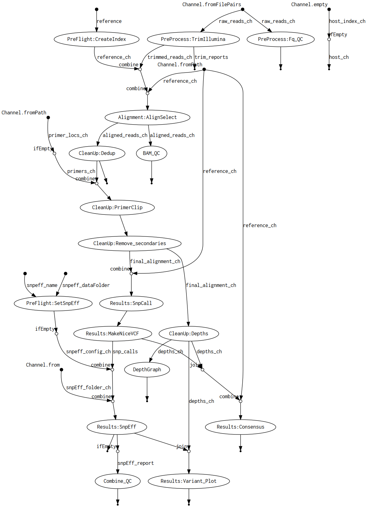
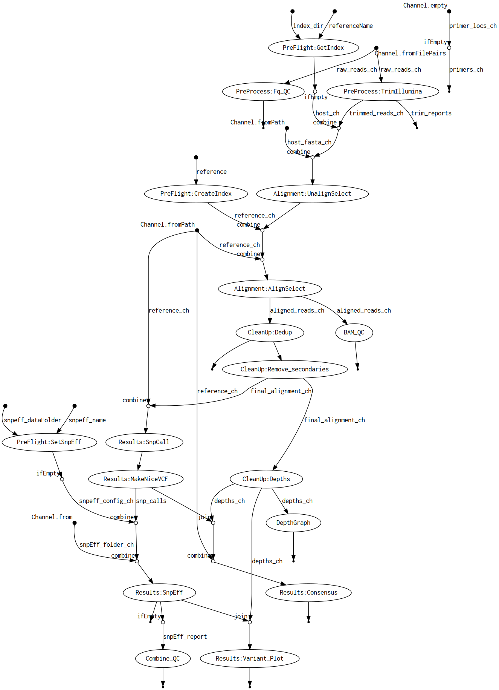
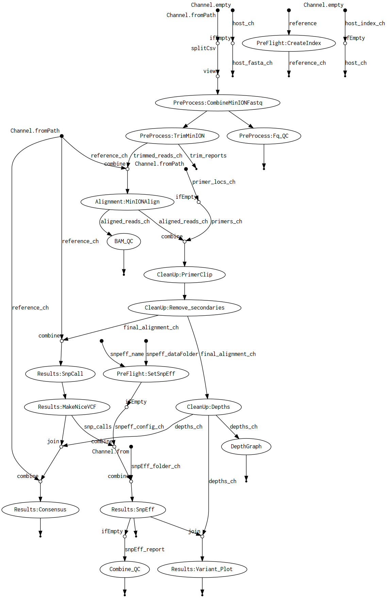

# nf-ViralMutations

## Pipeline intent

This pipeline is intended to be used to align Illumina or MinION reads to a reference and call the mutations and consensus.
The mutations called include non-consensus mutations, which is useful when looking at the dynamics of the viral population over time.
The pipeline is designed to allow a number of options for analysis:

- Host removal (Illumina and MinION, non-competitive)
- Primer clipping (position-based) (Illumina and MinION)
- Targeted downsampling (only downsamples regions above the threshold) (Illumina and MinION)
- The minimum depth and frequency thresholds can be adjusted separately for SNP reporting and consensus calling
  
The consensus will include IUPAC alternates if multiple alternate bases create a situation where neither an alternate nor the reference form consensus.

## Installation

The two installation requirements are [Nextflow](https://www.nextflow.io/docs/latest/install.html) and a container platform (the pipeline uses [Singularity](https://docs.sylabs.io/guides/3.5/user-guide/quick_start.html#quick-installation-steps) by default).

The executor is set to `slurm` by default, this can be changed (e.g. setting `process.executor = 'local'` in the file `configs/resources.config`) if SLURM is not installed on your computer (or your HPC uses a different scheduler).

## Running the pipeline

Assuming all the parameters are stored in a JSON or YAML file, navigate to the folder where you want the `nextflow` and `work` directories to be located and run the following command:

```shell
nextflow run /path/to/nf-ViralMutations/main.nf -params-file /loc/of/Params_Exp1.yml
```

## Parameters

The full set of parameters are described in the comments in the `nextflow.config` file.
Some less simple ones are explained below.
It is easier to assemble the pipeline parameters in a YAML or JSON file to be passed with the command line argument `-params-file`.

### Host reference

Since the hosts are usually eukaryotes, their large genome can take some time to index.
To mitigate this, it is also possible to specify the location of the index files.

#### For a new host reference

Set the `Host_Reference` parameter to the full path of the fasta (gzipped or not) sequence and set the `Host_IndexOutFolder` parameter to the location where to save the index (generally the same folder as the reference). (YAML)

```YAML
Host_Reference: "/home/user/Hosts/Human_T2TY.fa.gz"
Host_IndexOutFolder: "/home/user/Hosts"
Host_Indexed: false
Host_IndexFolder: ""
```

#### For a previously-indexed host reference

Set the `Host_Reference` parameter to the __file name__ of the fasta sequence and set the `Host_IndexFolder` parameter to tha location that contains both the fasta file and the index files. (JSON)

```JSON
{
    Host_Reference: "Human_T2TY.fa.gz",
    Host_IndexOutFolder: "",
    Host_Indexed: true,
    Host_IndexFolder: "/home/user/Hosts"
}
```

### Illumina adapter clipping

Illumina adapter removal is performed using Trim-Galore!.
It is possible to specify either the number of bases to clip from the 5' end of each base or the specific adapter sequences to trim (specify both).

To clip the first 14 bases from R2 (e.g. Takara stranded RNA prep, pico input): (YAML)

```YAML
Illumina_clipR1: 0
Illumina_clipR2: 14
```

To trim specific adapters from each read (e.g. Zymo Stranded RNA kit): (JSON)

```JSON
{
    Illumina_adapt1: "NNNNNNNNNNAGATCGGAAGAGCACACGTCTGAACTCCAGTCAC",
    Illumina_adapt2: "AGATCGGAAGAGCGTCGTGTAGGGAAAGA"
}
```

If you need to trim only one adapter or to specify other trimming options (leave a space at the end): (YAML)

```YAML
Illumina_TrimArgs: "-a NNNNNNNNNNAGATCGGAAGAGCACACGTCTGAACTCCAGTCAC "
```

### Alignment filtering

The alignments are filtered to, by default, remove secondary alignments and alignments with Map quality less than 30.
To change those parameters: (JSON)

```JSON
{
    Read_MinMAPQ: 20,
    Read_ExclFLAG: 0x810
}
```

### snpEff configuration

The pipeline uses snpEff to infer the effect of mutations.
The snpEff database is "rebuilt" for every run.
In order for the pipeline to run you must pass a name for the pathogen and a folder containing the sequence and annotations.
The entry is added to a barebones snpEff.config file saved in the pipeline directory which passed along to the snpEff process.
The entry is built in the folder specified, make sure it is write-accessible.
The folder should have the same name as the name passed to snpEff and contain two files: 

- `sequence.fasta` contains the fasta sequence (sequences for segmented genomes)
- `genes.gbk` contains the annotations in GenBank format (concatenated entries for segmented genomes)

The easiest way to assemble this folder is to download the entries (selecting all of them for segmented genomes) from GenBank (or other repository) directly.
If the annotations were modified and exported in a Windows software (e.g. DNASTAR's SeqBuilder), make sure the files have LF (and not CRLF) line endings.

### MinION data

MinION reads are usually stored in a folder called `fastq_pass` which contains a folder for each barcode (e.g. `barcode01`).
If this is the case for your data, set `MinION_split` to `true`.
The `Data_Folder` should be set to a path all the way to (and including) `fastq_pass` or its equivalent folder.
You will need to provide a csv file with two columns to the `MinION_samples` parameter (in order): 

- `Sample_Name` a space-free sample name
- `Barcode` the `barcodeXX` folder that contains the reads for that sample

If your data has already been collated and the read files have meaningful names, set `MinION_split` to `false` and `Data_Folder` to the folder that contains the read files.
If you data is collated but you want to change the sample names, put each read file in its own folder and follow the instructions for non-collated data.

YAML example for non-collated data:

```YAML
Data_Folder: "/home/user/Data/Experiment2/no_sample/run_guid/fastq_pass"
MinION_split: true
MinION_samples: "home/user/Data/Experiment2/no_sample/run_guid/samples.csv"
```

JSON example for pre-collated data:

```JSON
{
    Data_Folder: "/home/user/Data/Experiment3/no_sample/run_guid/collated_data",
    MinION_split: false
}
```

### Primer clipping

The pipeline uses BamClipper for positional primer clipping post-alignment.
This utility uses a 6-column bedpe format to identify primer locations:

RefName   FPrimerStart   FPrimerEnd  RefName   RPrimerStart   RPrimerEnd

The parameter `Primer_Locs` takes a path to this bedpe file.
If the bedpe file was generated by primalscheme or varVAMP, set `Primer_Format` to `ARTIC`.
**Note that varVAMP's bed file reports primer positions according to the consensus of the alignment.**
If the bedpe file is already in the correct 6-column format, set `Primer_Format` to `bamclipper`.

**IMPORTANT: It is assumed that in the ARTIC format, Forward and Reverse primers are on sequential lines. If you have alternate forwards or reverses, pair them with the correct primer. You should not have a file with lines that go: FFRFRRFRFR.**

### Other parameters

- `Result_Folder` defaults to `${params.Data_Folder}/../Results`, but can be changed.
- `Seq_Tech` should be either `Illumina` or `MinION`.
- `Target_Reference` is the path to the viral genome you are aligning to. Since viral genomes are generally small, it is always re-indexed.
- `Extension` specifies exactly what the extension of the original read files is, e.g.: `.fastq`, `.fa.gz`
- `Conda_cache` specifies where to store the conda environments for the pipeline, defaults to `${launchDir}`.
- `SLURM_Queue` to specify the SLURM queue or partition to be used. The pipeline defaults to `executor="slurm"`, change it in the config file or at the command line if necessary.
- `GenePos` (optional) an Excel file used to annotated the graph of SNPs with the following columns:
  - `CHR` The reference name.
  - `CDS_Name` The name to show on the graph. Assumes most annotation will be CDSs but doesn't check, so you can annotate any feature you want.
  - `Start` The 1-based position for the start of the CDS.
  - `Stop` The 1-based position for the end of the CDS.

## Outputs

Most intermediate files are saved into `Result_Folder` to allow QC of the different steps and to diagnose unexpected results.

### Key Outputs

- `{SampleName}_variants.pdf` Graphical presentation of all the SNPs that pass the depth and minimum frequency. If there are too many, some of the labels will be missing. The grey line represents the depth at each position (left axis) and the red bars position the SNPs along the genome; the red dots show the frequency of the SNP (right axis) along with error bars (based on binomial distribution using frequency and depth).
- `{SampleName}_variants_annot_filtered.tsv`Tab-separated summary of the SNPs/indels along with snpEff annotations. Can be opened in Excel or imported in R for further processing.
- `{SampleName}_variants_annot.vcf` Cleaned-up FreeBayes output (not filtered) with snpEff annotations.
- `{SampleName}_variants.vcf` Raw FreeBayes output.
- `{SampleName}_variants_annot.html` snpEff summary of the effect of mutations.
- `Alignments/{SampleName}_Aligned_pe.bam` Initial alignment to the `Target_Reference`. All derivatives created during clean-up are in the `Alignments` sub-folder, the order they are created is: _dd (deduplicated; Illumina-only), _pc (primer-clipped), _noSplit (filtered), _ds (downsampled; if max-depth was specified).
- `{SampleName}_consensus.fasta` The consensus sequence.

## Example DAGs

Given the different combinations, the DAGs below are not exhaustive but they reflect 3 common scenarios.

### Illumina PCR sequencing



### Illumina Shotgun sequencing with pre-indexed host sequence



### MinION PCR sequencing



## Support
Should any issues arise when running this pipeline, please create an issue for the moment.

## Legal
Copyright Government of Canada 2024

Written by: National Microbiology Laboratory, Public Health Agency of Canada

Licensed under the Apache License, Version 2.0 (the "License"); you may not use this work except in compliance with the License. You may obtain a copy of the License at:

http://www.apache.org/licenses/LICENSE-2.0

Unless required by applicable law or agreed to in writing, software distributed under the License is distributed on an "AS IS" BASIS, WITHOUT WARRANTIES OR CONDITIONS OF ANY KIND, either express or implied. See the License for the specific language governing permissions and limitations under the License.
